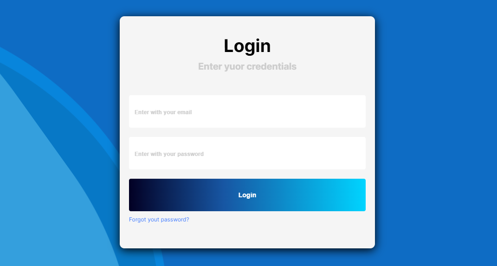

# Login Screen

## Projeto pessoal criando uma tela de login animada

- O projeto em foi desenvolvido em React, trata-se te uma tela de login animada.

## Tecnologias 🛠

- React
- Css
- Git
- GitHub

## Como ver o projeto ?

- Clonar o repositório com git clone
- Abrir a pasta do projeto no seu editor de código
- Executar o comando npm install ou npm i, isso irá baixar as dependencias do projeto.
- Após baixadas as dependencias só executar o comando npm run dev

### Observação, você precisa ter o node instalado!!!

# Contato

- bnascimento1996@gmail.com ❤

# LinkedIn

- https://www.linkedin.com/in/brunonascimento1996/ 🔗
